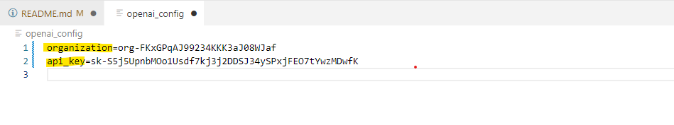

# Coding Assistant for PADS and UKY Statistics


## Step 1. Create an OpenAI account and obtain an API key and an organization ID

* [Finding your OpenAI organization ID](https://platform.openai.com/account/org-settings)
* [Generating and retrieving your OpenAI API Token](https://platform.openai.com/account/api-keys)
<br><br>


## Step 2. Clone the git repository and install packages
* For both Mac/Linux and Windows users, open the terminal / powershell and clone the repo.
* **Note**: For the Windows users, I ***strongly*** recommend using the WSL.
* Run following in the terminal
```bash
git clone https://github.com/leeparkuky/pads-coding-assistant.git
cd pads-coding-assistant
pip install -r requirements.txt
```

<br><br>

## Step 3. Copy and Paste the organization ID and API Token into `openai_config` file

**Note** : Don't forget to save the `openai_config`
<br><br>

## Step 4. Use the config_gpt.py

* **Option 1**: Using CLI (Using Mac/Linux terminal)
    - Quick start:
        - First, copy the code you want to evaluate or get a feedback on; More specifically, the codes to be copied in the clipboard.
        - `--language` argument tells ChatGPT to be an instructor for a specific programming language. The default language is *python*
        - If the code is running fine and is error-proof, ChatGPT may explain each component in the code.
        ```bash
        python coding_gpt.py --language "R"
        ```
    - When you have an error message:
        ```bash
        python coding_gpt.py --error_message "<error message>" --language "SAS"
        ```

    - Other options:
        - If you are not sure whether the codes are saved in the **clipboard** but want to paste them in the CLI command, use `--user_message` argument:
        ```bash
        python coding_gpt.py --user_message "<paste your wrong codes>" --error_message "<error message>" --language SQL --num_result 2
        ```
        
        - If you want to check other responses, set the `num_result` greater than 1
        ```bash
        python coding_gpt.py --error_message "<error message>" --num_result 2
        ```

        - If you want to save the response(s), set the `save_result` true. It will create a file `history.txt`
        ```bash
        python coding_gpt.py --error_message "<error message>" --num_result 2 --save_result true
        ```

* **Option 2**: Using it as a local module in a IPython kernel
- Quick start:
    - First, you need create an assistant object
        ```python
        from coding_gpt import *
        assistant = coding_assistance(record_history = True, continue_conversation = True) 
        ```
    - `record_history` will create the `history.txt` file and `continue_conversation` will enable the use of past conversations
    - Then, for the first conversation, just use the `get_chat_response` method function
        ```python
        assistant.get_chat_response()
        ```
        In the example above, wrong codes are in the **clipboard** and you don't want to or have an error message
        If you want to paste the wrong codes with the error message, do following:
        ```python
        assistant.get_chat_response(codes = "<wrong codes>" , error_message = "<error message>")
        ```
    - If you liked the response, and wish the GPT perform as well in the future, just let the assistant know you liked the previous response. It will remember how they responded previous question and will try to perform as good or better than previous.
        ```python
        assistant.like_it()
        ```
    - For the subsequent queries, you just use `get_chat_response` again. but suppose you want to have multiple responses, for example 3, and want to check the two best responses. Then set `samples` and `top_k` as 3 and 2 respectively. 
        ```python
        assistant.get_chat_response(codes = "<wrong codes>" , error_message = "<error message>",
                                    samples = 3, top_k = 2) # generate 3 responses and show 2 best responses
        ```
    


